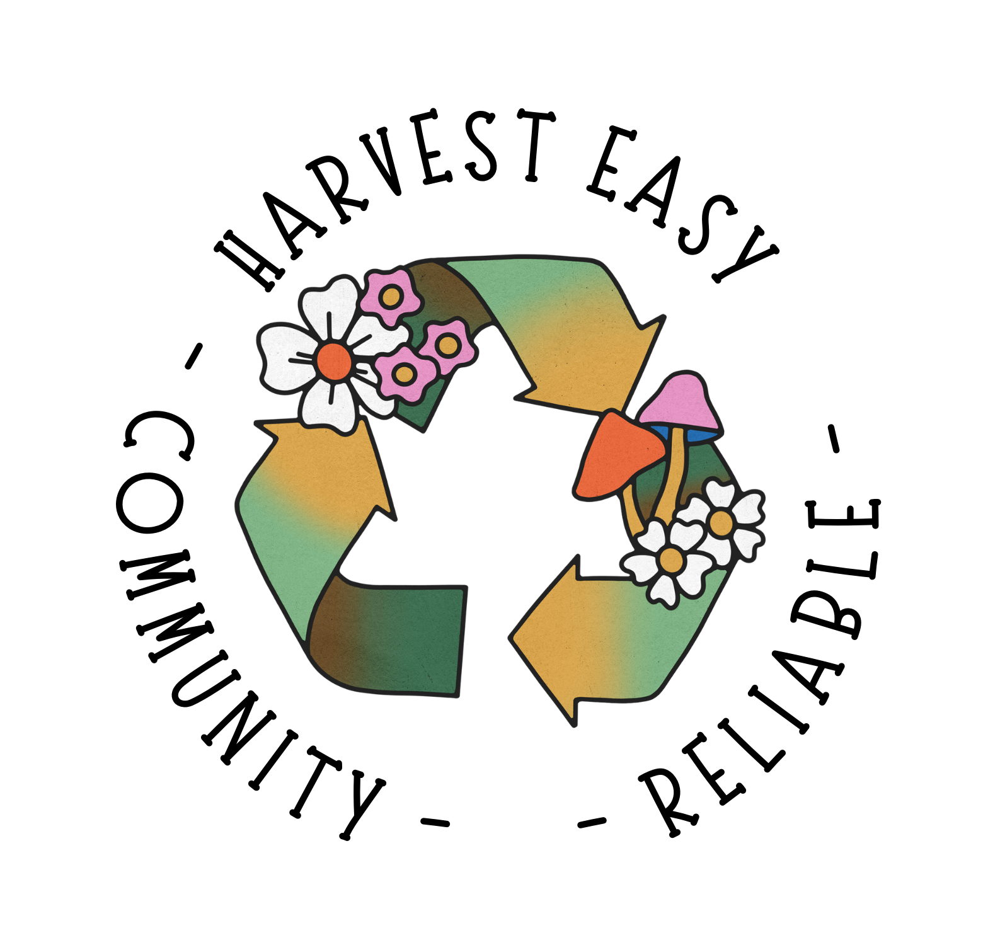
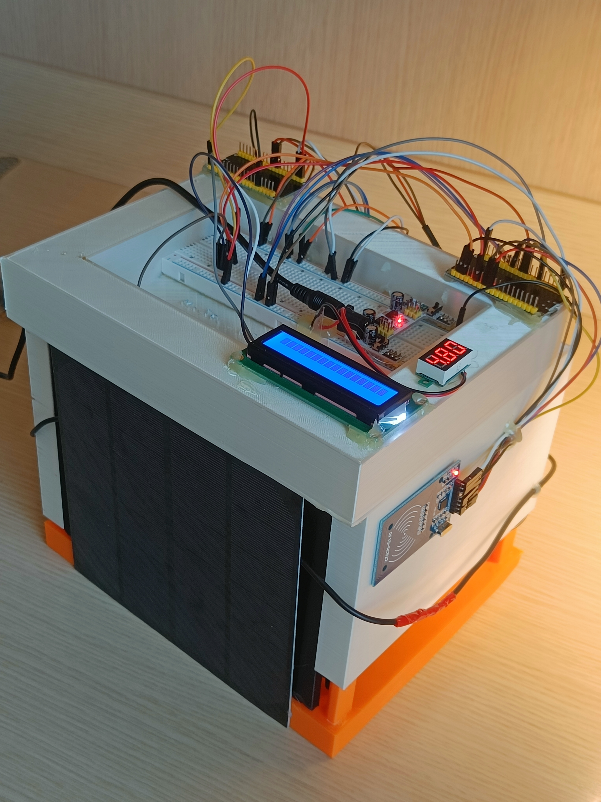
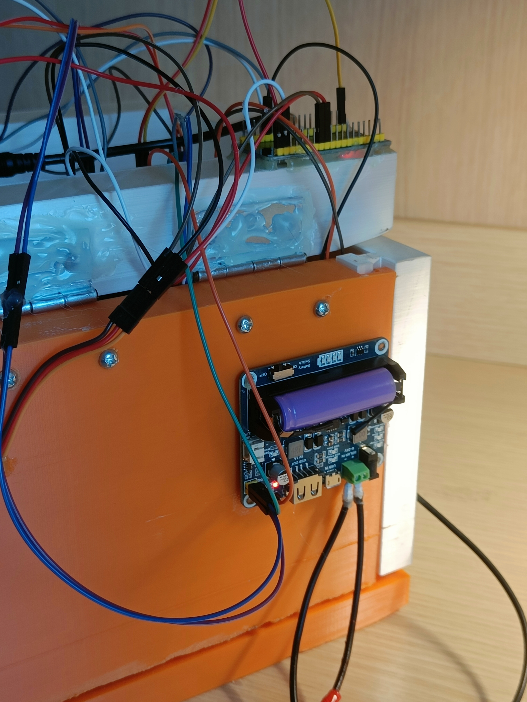

<!-- PROJECT LOGO -->

  

  <h1 align="center">Harvest Easy</h1>

  

    Una bella descrizione
  

<!-- TABLE OF CONTENTS -->
  <h4>
Table of Contents
</h4>
  <ol>
    <li><a href="#abstract">Abstract</a></li>
    <li>
      <a href="#demos">Demos</a>
      <ul>
          <li><a href="#image-showcase">Image showcase</a></li>
          <li><a href="#ap-init">Apartment Initalization</a></li>
          <li><a href="#react-fe">React Frontend</a></li>
          <li><a href="#telegram-bot">Telegram</a></li>
          <li><a href="#alerts">Alerts</a></li>
          <li><a href="#cads-showcase">Designed CADs showcase</a></li>
      </ul>
    </li>
    <li><a href="#tech-used">Technologies used</a></li>
    <li><a href="#hw-used">Hardware used</a></li>
    <li><a href="#slides">Project slides</a></li>
    <li><a href="#licensing">License</a></li>
    <li><a href="#contact-us">Contact Us</a></li>
  </ol>

# Abstract
Harvest Easy represents a modern solution for an old and known problem: domestic waste sorting at 360 degrees. We designed this from the really ground root, starting from the 3D CADs of the prototype up to the backend AI-powered solution and the user-friendly front-end, all equipped with the needed sensors & acturators. We started 3D printing with an organic plastic polymere (PLA) the bin prototype where we added on this the RFID reader, 16x2 LCD screen, two ESP32, different ultrasonic sensors HC-SR04, DHT11 for temperature and humidity, MQ135 for CO2 & air quality sensoring, MPU-6050 as accellerometer and gryscope module, 5W photovoltaic panel, MG90s Hi-Torque servo for the automatic lid opening, 14500 Li rechargable battery and a Solar Panel Managment with BMS (Battery Managment System) module.
The bin is described by 4 states: empty and intact (state 1), filled and intact (state 2), empty and tampered with (state 3) and filled and tampered with (state 4). The tampered state is reached when the bin is knocked over or set on fire. Each time the bin is opened, its internal fill level and, consequently, the status is updated. If the bin is knocked over or set on fire, a notification will be sent to the telegram bot of the condominiums of the apartment to which the bin belongs. In the event that the problem cannot be solved, a report is sent to the body responsible for waste collection which will resolve it.

# Demos

## Image Showcase

Bin             |  Bin
:-------------------------:|:-------------------------:
   |   

Bin             |  Bin
:-------------------------:|:-------------------------:
   |   

Bin             |  Bin
:-------------------------:|:-------------------------:
   |   

Bin             |  Bin
:-------------------------:|:-------------------------:
   |   

# Concept:
* Stato del bidone ("sano"/malfunzionante/manutenzione)
* Sensore di riempimento (prossimità)
* Sensore di temperatura
* Sensore di "vandalismo" : accelerometro + tilt sensor, tentativo di manomissione
* Raccolta dati per effettuare predizioni sul futuro livello di riempimento
* Motore che gestisce l'apertura/chiusura del pannello
* Dati salvati in Cloud
* Tempo raccolta pattume (Tempo di riempimento)
* Percorso ottimo basato sul livello di riempimento
* Alimentato ad energia solare + batteria
* Feedback sullo stato del bidone (lato User)