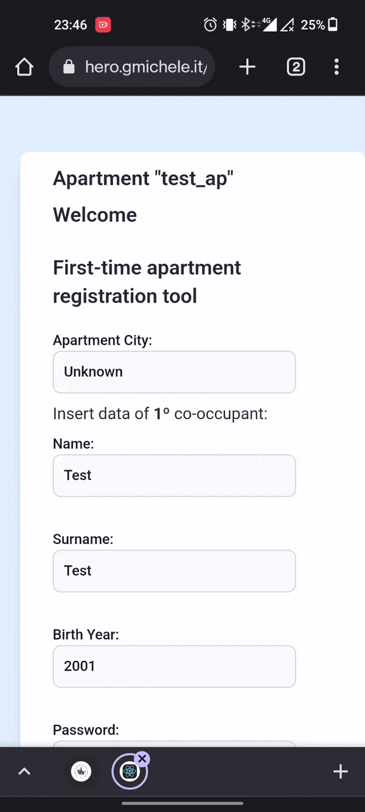
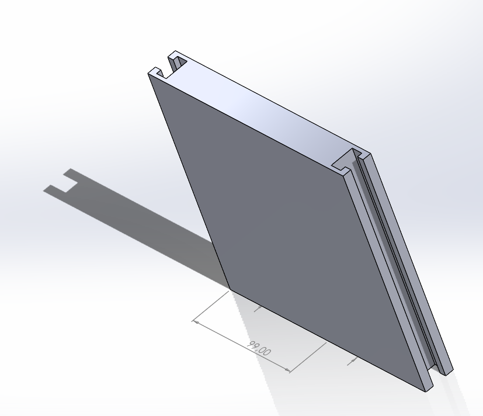
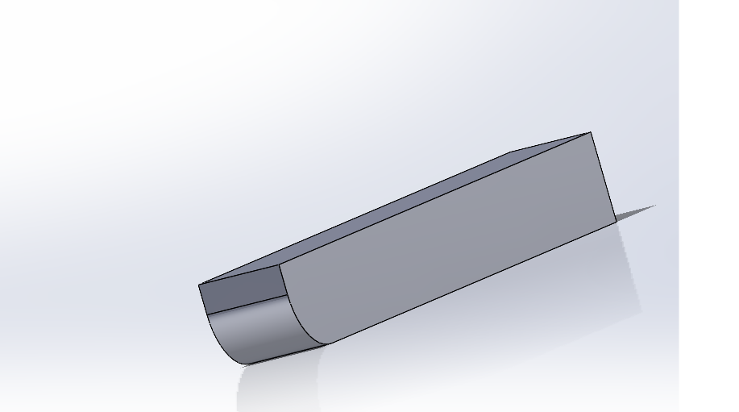

<!-- PROJECT LOGO -->

  

  <h1 align="center">Harvest Easy</h1>

<!-- TABLE OF CONTENTS -->
  <h4>
Table of Contents
</h4>
  <ol>
    <li><a href="#abstract">Abstract</a></li>
    <li><a href="#goals-and-why">Goals and Why</a></li>
    <li>  <a href="#demos">Demos</a> </li>
      <ul>
          <li><a href="#image-showcase">Image showcase</a></li>
          <li><a href="#react-frontend">React Frontend</a></li>
          <li><a href="#telegram-bot">Telegram</a></li>
          <li><a href="#alerts">Alerts</a></li>
          <li><a href="#cads-showcase">Designed CADs showcase</a></li>
      </ul>
    </li>
    <li><a href="#tech-stack">Tech stack</a></li>
    <li><a href="#hw-used">Hardware used</a></li>
    <li><a href="#slides">Project slides</a></li>
    <li><a href="#licensing">License</a></li>
    <li><a href="#contact-us">Contact Us</a></li>
  </ol>

# Abstract
Harvest Easy represents a modern solution for an old and known problem: domestic waste sorting at 360 degrees. We designed this from the really ground root, starting from the 3D CADs of the prototype up to the backend AI-powered solution and the user-friendly front-end, all equipped with the needed sensors & acturators. We started 3D printing with an organic plastic polymere (PLA) the bin prototype where we added on this the RFID reader, 16x2 LCD screen, two ESP32, different ultrasonic sensors HC-SR04, DHT11 for temperature and humidity, MQ135 for CO2 & air quality sensoring, MPU-6050 as accellerometer and gryscope module, 5W photovoltaic panel, MG90s Hi-Torque servo for the automatic lid opening, 14500 Li rechargable battery and a Solar Panel Managment with BMS (Battery Managment System) module.

During the night the bin is powered by a battery which is recharged by a solar panel during the day.
Energy management is managed by the BMS which switches between the battery and the panel based on the energy supplied by the panel itself

The bin can be in one out four states: empty and intact (state 1), full and intact (state 2), empty but tampered (state 3), full and tampered (state 4). The tampered state is achieved when the bin is knocked over or set on fire. Each time the bin lid is opened (by users or operators) its internal fill level and, consequently, the status is updated. If the bin is knocked over or set on fire, a notification will be sent to the apartment users through the telegram bot. If the problem cannot be solved, a report is also sent to the body responsible for waste collection (or public service) which will resolve it.

The telegram bot will give points to every user that solves a reported problem. We introduced this gamification system in which points can be earned and are eventually shown on a leaderboard through both the telegram bot and the service webpage. In this way we wanted to make users more aware & active towards our society.

In order to discourage and avoid the abandonment of waste next to the bin if happens to be full, Harvest Easy introduces a "proximity access" system: when the tenant swipes the card to authenticate in order to leave the trash but the bin happens to be full, the street address of the nearest free bin (respecting the waste sorting) will be shown on the screen (this is achieved thanks to open routing services built on top of OSM nodes).

Harvest Easy provides access to city maps through which it is possible to see all the bins present in the city of interest. We already implemented many intresing filters to satisfy both the commercial & analytics side and the wasting retrieval company one.

To improve the waste collection system, Harvest Easy is able to predict the possible future fill level, thanks to a time series model prediction. This feature is useful both for users and the company.

Harvest Easy provides a waste collection optimization system: taking into account the type of vehicle, the bins to be emptied, the prediction of bins close to being filled, and the fuel level to show the optimal route for the operator to travel. In this way only the full or almost full ones will be included in the retrieval path and is also already implemented a feature that computes the approximate kWh needed for the round trip, in this way only the (possibly autonomous but electrical) trucks with enough autonomy will depart.

# Goals and Reasons

This project has been developed for the exam *IoT & 3D Intelligent Systems* @ University of Modena and Reggio Emilia we were willing to propose a solution to a paper we read that shows the impact of waste transportation *Banias, G., Batsioula, M., Achillas, C., Patsios, S. I., Kontogiannopoulos, K. N., Bochtis, D., & Moussiopoulos, N. (2020). A Life Cycle Analysis Approach for the Evaluation of Municipal Solid Waste Management Practices: The Case Study of the Region of Central Macedonia, Greece. Sustainability, 12(19), 8221* using data provided from the italian national report from 2019 viewable [here](https://www.isprambiente.gov.it/files2019/pubblicazioni/rapporti/RapportoRifiutiUrbani_VersioneIntegralen313_2019_agg17_12_2019.pdf).

Our goals:
- Peeking into the future basing our architecture & design on autonomous driving waste retrieval trucks
- Gamified community-based whistleblowing
- Sun powered
- Low maintenance
- Easily scalable
- Data harvesting & data filtering
- Sellable clean data
- Behaviour analysis
- Ready & pluggable into other solutions
- Pluggable into private security services
- Proprietary prototype-ready license-less design
- Powerful branding & motto

# Demos

## Image Showcase

3/4 view             |  rear view
:-------------------------:|:-------------------------:
   |   

side apartment QR             |  top view
:-------------------------:|:-------------------------:
   |   

under lid/inside view             |  front view
:-------------------------:|:-------------------------:
   |   

## React Frontend

Once the apartment manager scans the bin group QR code for initialization he will be automatically redirected to the ap. init. portal on which he will add all the apartment infos such as:
- Location infos (apartment name, street, number, city)
- Tenants infos (how many, data for each including their telegram username)
- Waste sorting infos (which sorting that apartment will follow)

 

After the manager inits the apartment each user will be able to login

 

After the user logs in the apartment dashboard will be shown, here the status of each bin, infos about the apartment and future predictions are shown

 

## Telegram Bot

Each user will be able to report for damages thus earning points, some special roles like civil servants, police etc will also be able to fix the damage and flag that; these roles won't earn points with the logic that is their duty to do this.

As we can see in this clip the bot (backend) is the first to multicast to every user in that city the damage, this is possible thank to the bin sensors which allow us to detect tampering as fire, overthrow or maximum capacity reached (this last is not flagged to users).

We introduced this bot along the city limited leaderboard for citizen too as a gamification of this problem

 

## CADs showcase

bottom            |  bottom
:-------------------------:|:-------------------------:
   |   

fem wall             |  male wall
:-------------------------:|:-------------------------:
   |   

servo-lid hand             |  top
:-------------------------:|:-------------------------:
   |   

# Tech Stack

# Alerts

# Project Presentation

If you are curious but don't want yet to deep dive into the code you can check our presentations [here](./slides/).

**Pitch:** [click here](./slides/HE%20-%20Pitch.pdf)

**Sys Design:** [click here](./slides/HE%20-%20System%20Design.pdf)

**Technical + CAD:** [click here](./slides/HE%20-%20Technical%20and%20CAD.pdf)

# Licensing
Distributed under the MIT License. See `LICENSE.txt` for more information.

# Contact Us

Vincenzo Lapadula - [Linkedin][linkedin-vin] - [Github][github-vin]  
Michele Giarletta - [Linkedin][linkedin-mich] - [Github][github-mich] - [Personal][personal-mich] 
Alessia Saporita -  [Github](https://github.com/alessiasaporita)

<!-- Links agli shield -->
[linkedin-shield]: https://img.shields.io/badge/-LinkedIn-black.svg?style=for-the-badge&logo=linkedin&colorB=555
[linkedin-vin]: https://www.linkedin.com/in/vincenzo-lapadula-85a937164/
[linkedin-mich]: https://www.linkedin.com/in/michele-giarletta/
[github-vin]: https://github.com/Theviki20110
[github-mich]: https://github.com/mich2k
[personal-mich]: https://gmichele.com/

